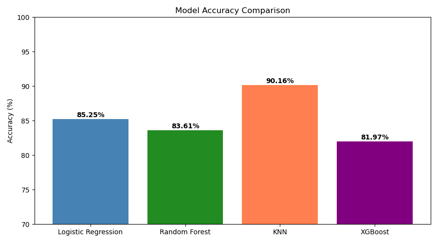
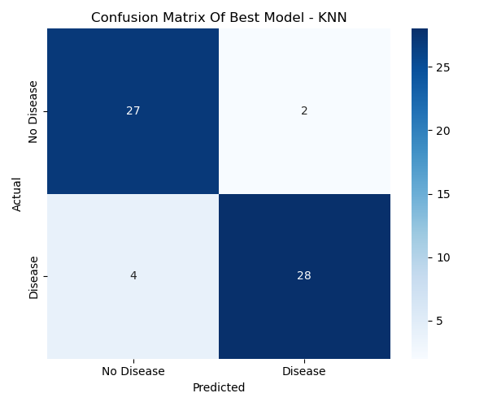
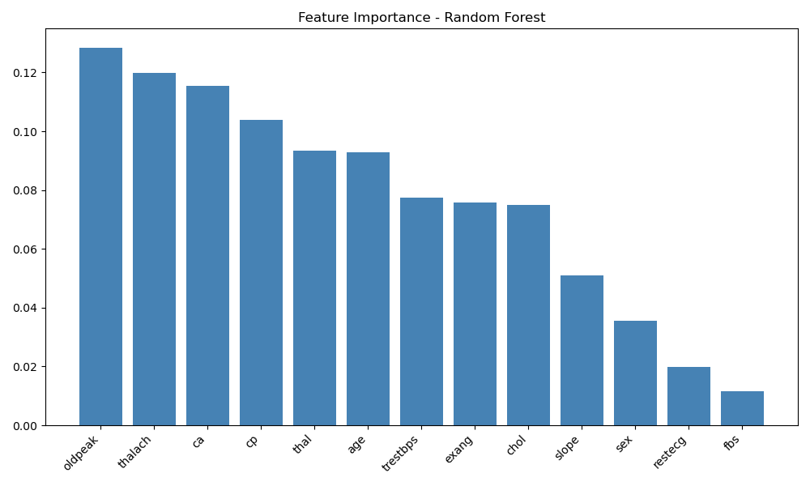
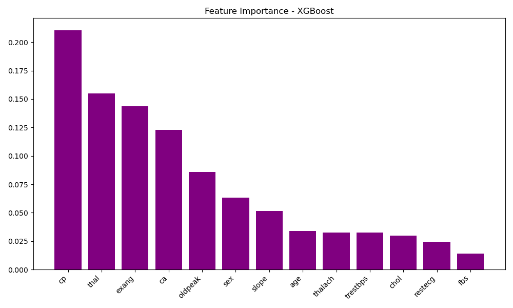
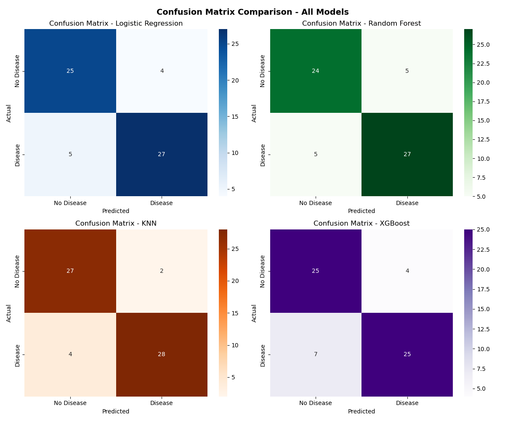

<div align="center">

# ❤️ Heart Disease Prediction Using Machine Learning

### Predicting heart disease using multiple machine learning algorithms and comparing their performance.


</div>

---

## 📊 Project Highlights

- 🤖 Compared **4 Machine Learning Models**
  - K-Nearest Neighbors (KNN)
  - Logistic Regression
  - Random Forest
  - XGBoost
- 🎯 **Best Model:** **K-Nearest Neighbors (KNN)** — **90.16% Accuracy**
- 📈 Compared model performance using multiple evaluation metrics
- 📊 Evaluated models using confusion matrices
- 🌟 Performed feature importance analysis using Random Forest and XGBoost
- ❤️ Predicted heart disease using clinical patient data

---

# 📚 Table of Contents

- [Project Title](#project-title)
- [Brief One Line Summary](#brief-one-line-summary)
- [Overview](#overview)
- [Problem Statement](#problem-statement)
- [Dataset](#dataset)
- [Tools and Technologies](#tools-and-technologies)
- [Methods](#methods)
- [Key Insights](#key-insights)
- [Dashboard / Model / Output](#dashboard--model--output)
- [How to Run this Project?](#how-to-run-this-project)
- [Results & Conclusion](#results--conclusion)
- [Future Work](#future-work)
- [Project Structure](#project-structure)
- [Author](#author)

---

# Project Title

Heart Disease Prediction Using Machine Learning

---

# Brief One Line Summary

A machine learning project that predicts the likelihood of heart disease using patient health records and compares multiple classification algorithms.

---

# Overview

Heart disease remains one of the leading causes of death worldwide. Early prediction can help healthcare professionals identify high-risk patients and support timely medical intervention.

This project applies multiple machine learning algorithms to predict whether a patient is likely to have heart disease based on clinical data. Different models are trained, evaluated, and compared to determine the best-performing classifier.

---

# Problem Statement

Develop a machine learning model capable of accurately predicting the presence of heart disease using patient medical records.

---

# Dataset

**Dataset:** Heart Disease Dataset

**File:** `heart.csv`

The dataset contains **303 patient records** with **14 attributes**, where **13 are input features** and **1 is the target variable**.

| Feature | Description |
|---------|-------------|
| age | Age of the patient (years) |
| sex | Gender (1 = Male, 0 = Female) |
| cp | Chest pain type |
| trestbps | Resting blood pressure (mm Hg) |
| chol | Serum cholesterol (mg/dL) |
| fbs | Fasting blood sugar (>120 mg/dL) |
| restecg | Resting electrocardiographic results |
| thalach | Maximum heart rate achieved |
| exang | Exercise-induced angina |
| oldpeak | ST depression induced by exercise relative to rest |
| slope | Slope of the peak exercise ST segment |
| ca | Number of major vessels colored by fluoroscopy |
| thal | Thalassemia status |
| target | Heart disease prediction (0 = No Disease, 1 = Disease) |

---

# Tools and Technologies

- Python
- Jupyter Notebook
- Pandas
- NumPy
- Matplotlib
- Seaborn
- Scikit-learn
- XGBoost

---

# Methods

The following workflow was followed:

1. Data Collection
2. Data Preprocessing
3. Exploratory Data Analysis (EDA)
4. Feature Engineering
5. Model Training
6. Model Evaluation
7. Model Comparison

### Machine Learning Models

- Logistic Regression
- Random Forest
- XGBoost
- K-Nearest Neighbors

### Evaluation Metrics

- Accuracy
- Precision
- Recall
- F1 Score
- Confusion Matrix

---

# Key Insights

- K-Nearest Neighbors (KNN) achieved the highest prediction accuracy of 90.16%.
- Evaluated models using standard classification metrics.
- Identified important medical features affecting predictions.
- Visualized feature importance using Random Forest and XGBoost.
- Compared overall model accuracy.

---

# Dashboard / Model / Output

The project contains the following outputs:

- Accuracy Comparison Graph
- Confusion Matrix
- Combined Confusion Matrix
- Random Forest Feature Importance
- XGBoost Feature Importance

### Output Images

| Accuracy Comparison |
|--------------------|
|  |

| Confusion Matrix |
|------------------|
|  |

| Feature Importance (Random Forest) |
|------------------------------------|
|  |

| Feature Importance (XGBoost) |
|------------------------------|
|  |

| Combined Confusion Matrix |
|--------------------------|
|  |

---

# How to Run this Project?

## Clone the repository

```bash
git clone https://github.com/priyansudas2005/heart-disease-prediction-ml.git
```
## Go to the project folder

```bash
cd heart-disease-prediction-ml
```

## Install dependencies

```bash
pip install -r requirements.txt
```

## Launch Jupyter Notebook

```bash
jupyter notebook
```

Open:

```
heart_disease_prediction.ipynb
```

Run all cells.

---

# Results & Conclusion

The machine learning models successfully classified patients based on clinical patient data.

Among the four models, K-Nearest Neighbors (KNN) achieved the highest prediction accuracy of 90.16%, making it the best-performing model in this project.

Feature importance analysis using Random Forest and XGBoost also highlighted the most influential medical features contributing to heart disease prediction.

---

# Future Work

- Hyperparameter tuning
- Cross-validation
- Deep Learning implementation
- Streamlit Web Application
- Flask API Deployment
- Real-time prediction system

---

# Project Structure

```
heart-disease-prediction-ml/
│
├── dataset/
│   └── heart.csv
│
├── images/
│   ├── accuracy_comparison.png
│   ├── confusion_matrix.png
│   ├── confusion_matrix_all.png
│   ├── feature_importance_rf.png
│   └── feature_importance_xgb.png
│
├── notebook/
│   └── heart_disease_prediction.ipynb
│
├── README.md
├── requirements.txt
├── LICENSE
└── .gitignore
```

---

# Author

**Priyansu Das**

B.Tech Computer Science and Engineering
